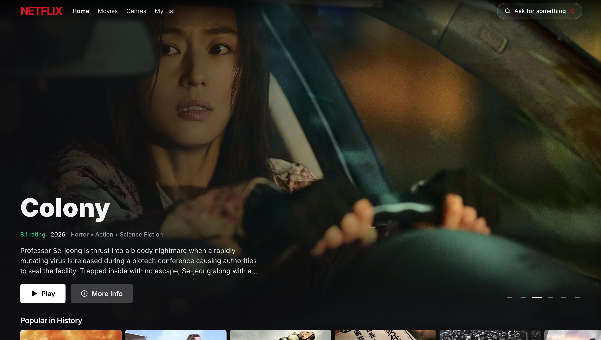
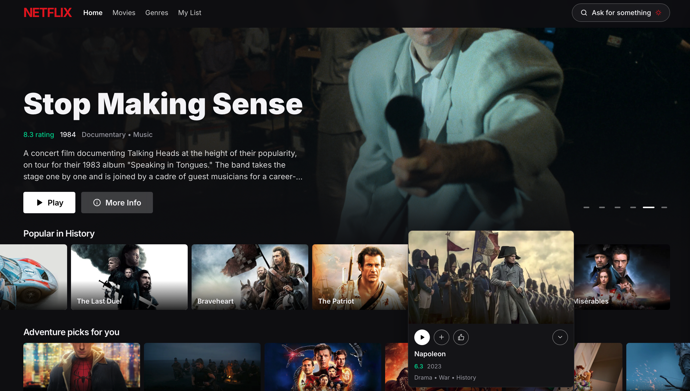
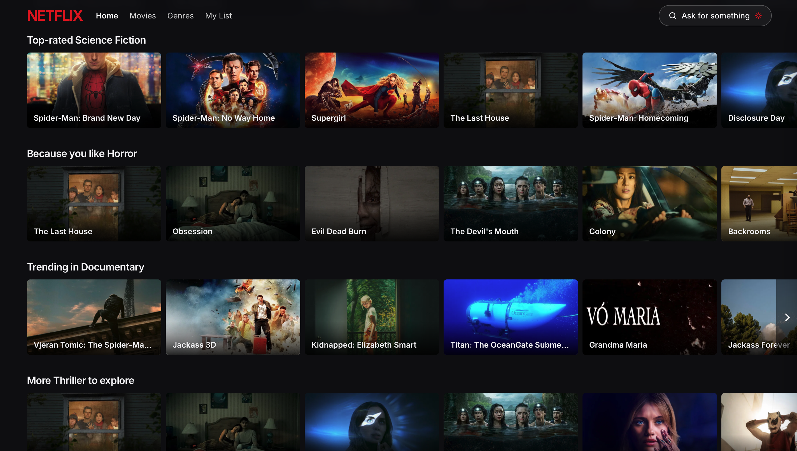
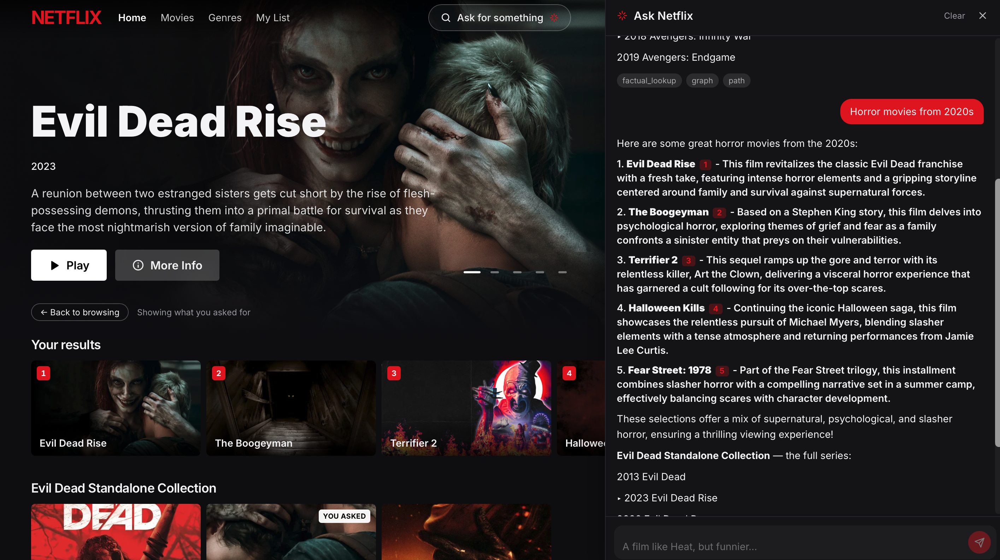
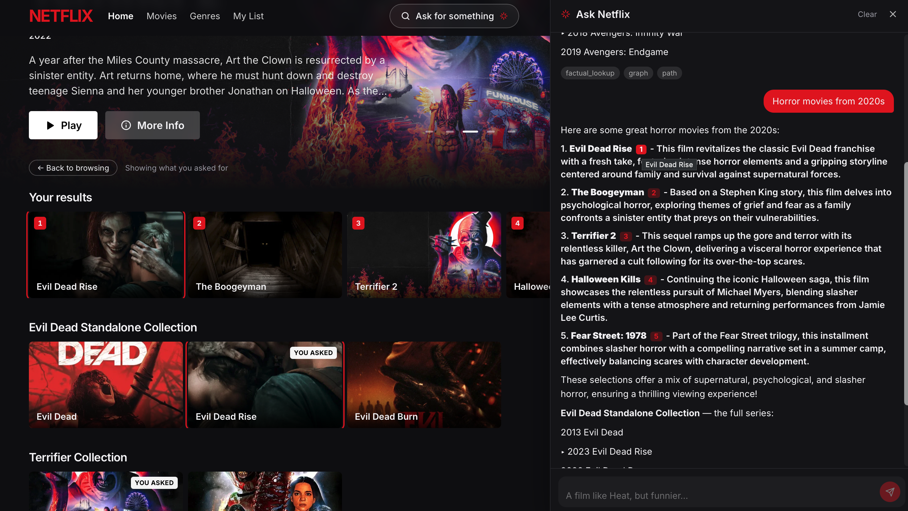
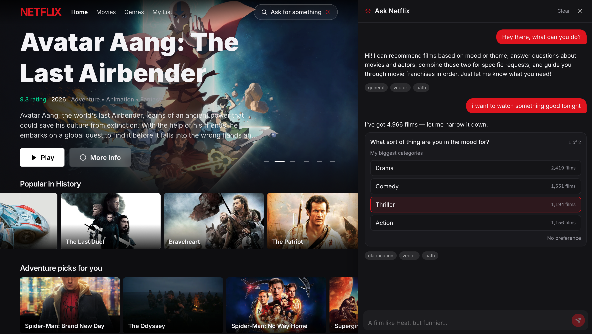
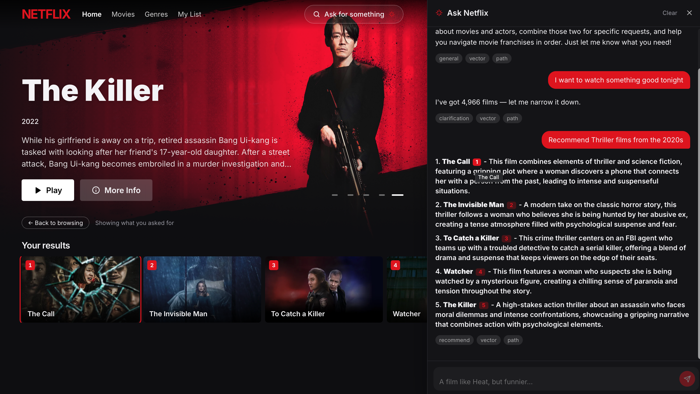
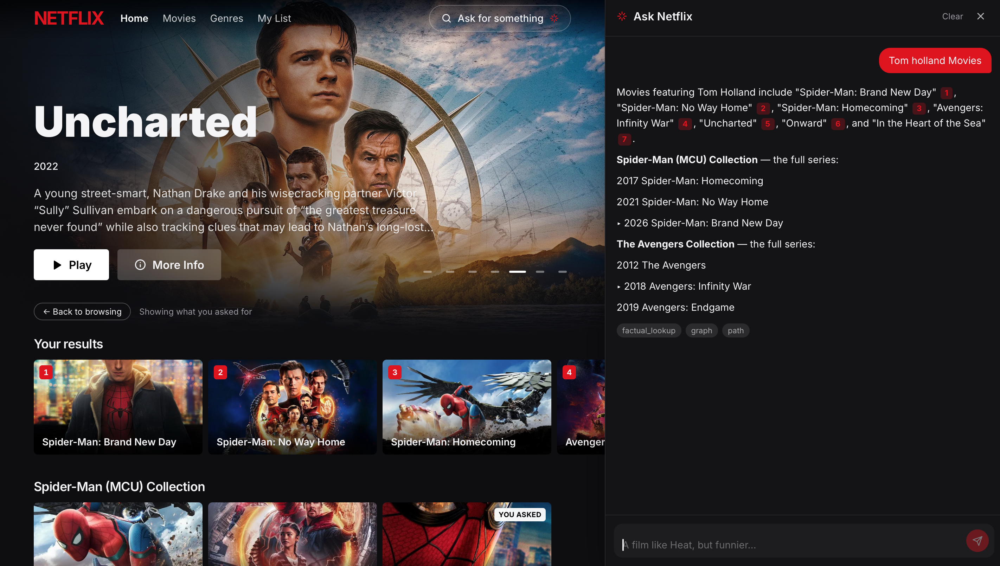
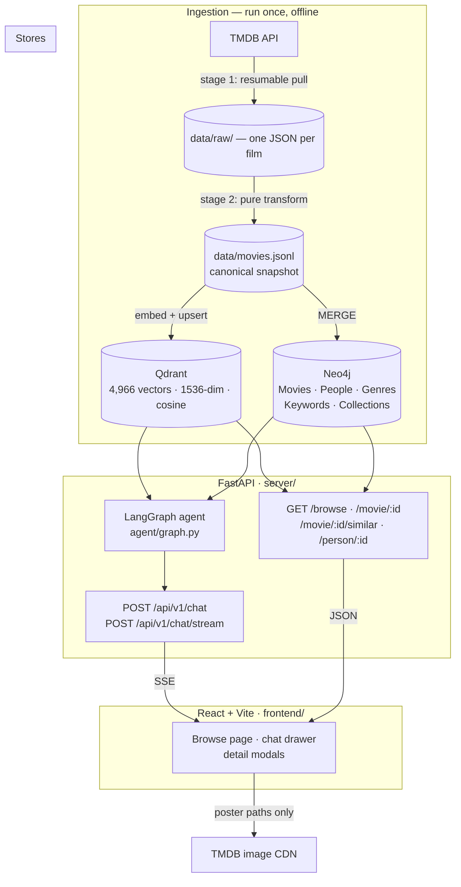
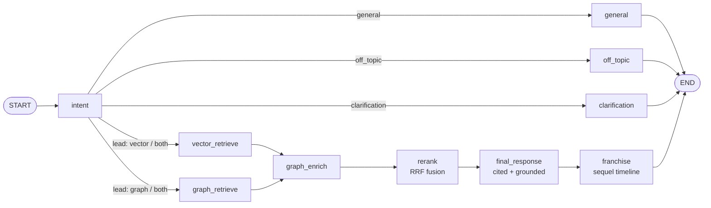

<div align="center">

# 🎬 CineRAG

**An intent-driven movie recommendation agent built on a vector store *and* a knowledge graph.**

Ask it for a *vibe* and it searches meaning. Ask it for a *fact* and it traverses relationships.
It knows which one you meant — and when it can't tell, it asks.

[](https://www.python.org/)
[](https://fastapi.tiangolo.com/)
[](https://langchain-ai.github.io/langgraph/)
[](https://qdrant.tech/)
[](https://neo4j.com/)
[](https://react.dev/)

</div>

---

<!-- ═══════════════════════════════════════════════════════════════════════════
     SCREENSHOT SLOT 1 — the money shot.
     Drop your best full-page browse screenshot at docs/images/hero.png
     (recommended: 2560×1440 or a 16:9 crop of the browse page with the
     hero carousel + a couple of genre rows visible).
     ═══════════════════════════════════════════════════════════════════════ -->

<div align="center">
  
  <br>
  <em>The browse page. It renders before you have asked anything — then the shelf becomes the answer.</em>
</div>

---

## Table of contents

- [What this is](#what-this-is)
- [Why two stores](#why-two-stores)
- [Screenshots](#screenshots)
- [Architecture](#architecture)
- [The agent graph](#the-agent-graph)
- [Data model](#data-model)
- [Quick start](#quick-start)
- [Building the data](#building-the-data)
- [Running it](#running-it)
- [API reference](#api-reference)
- [The frontend](#the-frontend)
- [Evaluation](#evaluation)
- [Testing](#testing)
- [Configuration](#configuration)
- [Project layout](#project-layout)
- [Design decisions worth knowing](#design-decisions-worth-knowing)
- [Troubleshooting](#troubleshooting)
- [Credits](#credits)

---

## What this is

CineRAG is a full-stack RAG system over ~5,000 real TMDB films. It has three parts:

| Part | What it does |
| --- | --- |
| **Ingestion** | Pulls TMDB → normalises to one canonical snapshot → builds both stores from it |
| **Agent** | A LangGraph state machine that classifies intent, routes to the right store(s), fuses results, and writes a cited answer |
| **Surface** | A FastAPI service (batch + streaming) and a React browse UI that shares the same two stores |

The thing that makes it more than a demo is the routing. Most RAG systems embed the
question and hope. CineRAG decides *what kind of question it is* first, and that decision
picks the retrieval strategy.

```
"something tense and claustrophobic"    → vector    (a vibe — meaning search)
"who directed Whiplash"                 → graph     (a fact — traversal)
"gritty crime dramas with Denzel"       → both      (a vibe, hard-constrained by a person)
"recommend some movies"                 → clarify   (too vague — ask, don't guess)
"what's the weather in Paris"           → decline   (not a movie question)
```

---

## Why two stores

This is the argument the whole architecture rests on, so it's worth stating plainly.

The codebase talks about **two librarians**:

> **Vera** has read every book in the building. Ask her for "something tense and
> claustrophobic" and she'll hand you five excellent novels. Ask her "who wrote *Dune*"
> and she'll still hand you five novels — she works on feel, and there is *always* a
> nearest book. **She never says "no such book."** That is her strength and her danger.
>
> **Gopal** has read nothing, but the card catalogue is exact. Ask him "who directed
> *Whiplash*" and you get one correct name. Ask him for "tense and claustrophobic" and he
> gives you nothing at all — and his nothing is *honest*, not a failure to understand.

Vera is Qdrant. Gopal is Neo4j. A vector store cannot answer *"which films share a cast
member with this one"* without hallucinating a plausible-looking neighbour, and a graph
cannot answer *"what feels like a rainy Sunday"* at all. Conflating a vibe with a fact is
precisely the failure mode this split exists to avoid.

See it for yourself:

```bash
uv run python -m scripts.compare
```

It puts one vibe query and one fact query to **both** stores. Two answers are good and
two are bad — and *why* they're bad is the argument.

---

## Screenshots

<!-- ═══════════════════════════════════════════════════════════════════════════
     SCREENSHOT SLOTS 2–8.
     Save each file into docs/images/ using the exact filename in the src="…".
     Delete any block you don't want; the README reads fine without them.
     Tips for good captures:
       • Browser at 1440px wide or more, device pixel ratio 2 if you can.
       • Hide bookmark bars / extensions — crop to the page content.
       • PNG for UI, keep each file under ~1.5 MB so the page loads fast.
     ═══════════════════════════════════════════════════════════════════════ -->

### The browse surface

<table>
<tr>
<td width="50%">
  
  <br><strong>Hero carousel.</strong> Every slide is guaranteed to have a backdrop —
  a 2:3 poster stretched across 16:9 letterboxes, so a film without one can't be a hero.
</td>
<td width="50%">
  
  <br><strong>Genre rows.</strong> Hover shows the blurb and tags without a second
  request — they ride along in the query the row already ran.
</td>
</tr>
</table>

### Asking it something

<table>
<tr>
<td width="50%">
  
  <br><strong>A cited answer, streamed.</strong> The <code>[1]</code> markers are live
  controls — click one and it scrolls to and rings the card it cites.
</td>
<td width="50%">
  
  <br><strong>The shelf becomes the answer.</strong> Genre rows are replaced by the films
  the agent actually cited, in the order it cited them.
</td>
</tr>
</table>

### When it doesn't guess

<div align="center">
  
  <br>
  <em><strong>Grounded clarification.</strong> Every option is counted straight out of the
  graph, so nothing you can click returns zero films. An LLM inventing "80s martial arts"
  could offer a category matching none of the 4,966 titles — which makes asking worse than
  not asking.</em>
</div>

### Detail views

<table>
<tr>
<td width="50%">
  
  <br><strong>Movie detail.</strong> Cast and crew from the graph, plus two <em>different</em>
  kinds of related — vector neighbours ("feels like it") and the franchise timeline
  ("belongs with it"), kept in separate rows on purpose.
</td>
<td width="50%">
  
  <br><strong>Person filmography.</strong> Addressed by <code>person_id</code>, never by
  name — 48 people in this catalogue share a name with someone else.
</td>
</tr>
</table>

---

## Architecture



Two things this diagram is trying to say:

1. **The browse surface never touches the LLM.** A browse page has to render before anyone
   has asked a question, and a detail modal needs credits the agent never carries. So there
   is a second, read-only API with no intent routing and no embedding of user text.
2. **This backend never stores or serves image bytes.** The API returns TMDB *paths*; the
   browser builds `https://image.tmdb.org/t/p/w500{path}` and loads from TMDB's CDN.

---

## The agent graph



**One LLM call decides everything.** `intent_node` uses OpenAI structured outputs to return
five things at once:

| Field | Meaning |
| --- | --- |
| `intent` | which branch of the graph runs at all |
| `lead_engine` | `vector` \| `graph` \| `both` — which store(s) lead retrieval |
| `refined_query` | a self-contained restatement, so retrieval never needs the history |
| `filters` | **hard** constraints — anything failing them is excluded |
| `entities` | **soft** signals — used to traverse and score, never to exclude |

The hard/soft split matters. A soft signal that reaches a store as a filter turns a
slightly-wrong query into *zero* results, which looks identical to "no such film exists."

### The nodes

| Node | Job |
| --- | --- |
| `intent` | Classify, route, extract. The only routing decision in the system. |
| `vector_retrieve` | Qdrant dense search on `refined_query`, hard-filtered on payload. Top 20. |
| `graph_retrieve` | Cypher. Two strategies: exact-title shortcut first, then constraint search. Top 20. |
| `graph_enrich` | Annotates films *already found* with link signals. Never introduces a new title. |
| `rerank` | Reciprocal Rank Fusion of both candidate lists → top 15. |
| `final_response` | Writes the answer. **May only name films retrieval actually returned.** |
| `franchise` | Runs *after* the answer, over the films it cited — appends a timeline rather than influencing the recommendation. |
| `clarification` | Asks a narrowing question whose options are counted out of the graph. |
| `general` / `off_topic` | No retrieval. `off_topic` doesn't even call the LLM. |

### Why RRF, and not score averaging

Two judges rank the same competition. You **cannot** average their scores — Qdrant returns
a cosine similarity, Cypher returns unscored rows, and there is no common unit. You *can*
average their positions, because "1st" means the same thing to everyone.

```
rrf(film) = Σ over each list containing it:  1 / (K + rank_in_that_list)      K = 60
```

A film both stores ranked collects **two** contributions that sum — so "appeared in both
lists" needs no special-case bonus rule. It's arithmetic.

The genre and quality bonuses on top are deliberately calibrated to be small relative to
the RRF spread (≈ 2 positions and ≈ 1 position respectively), which is a number that was
worked out rather than guessed. Anything approaching the whole-list spread would reorder
everything and make the fusion decorative.

### Parallel fan-out and reducers

When `lead_engine == "both"`, LangGraph starts both retrievers in the *same superstep*.
An un-annotated state key written twice in one superstep raises `InvalidUpdateError` —
LangGraph does not silently pick a winner. So `trace`, `retrieval_errors`,
`vector_results` and `graph_results` carry `Annotated[list, operator.add]` reducers.

There's a test that proves this rather than asserting it in a comment:
`tests/test_agent.py::test_without_a_reducer_concurrent_writes_are_rejected`.

---

## Data model

### Neo4j — the fact store

```
(:Movie {tmdb_id, title, year, rating, runtime, overview, poster_path, …})
(:Person {person_id, name, name_normalized})
(:Genre {name})
(:Keyword {name})
(:Collection {id, name})

(:Person)-[:DIRECTED]->(:Movie)
(:Person)-[:ACTED_IN {character, order}]->(:Movie)
(:Movie)-[:HAS_GENRE]->(:Genre)
(:Movie)-[:HAS_KEYWORD]->(:Keyword)
(:Movie)-[:PART_OF]->(:Collection)
```

Uniqueness constraints on `Movie.tmdb_id`, `Person.person_id`, `Genre.name`,
`Keyword.name`, `Collection.id`, plus indexes on `Person.name` and
`Person.name_normalized`. Everything is `MERGE`d, so the build is idempotent — run it
twice and nothing duplicates.

> **People merge on `person_id`, never on name.** Merging on name would collapse two
> different actors who happen to share one into a single node with a hybrid filmography.

### Qdrant — the meaning store

| | |
| --- | --- |
| Collection | `movies` |
| Vectors | 1536-dim, cosine (`text-embedding-3-small`) |
| Point ID | `tmdb_id` — which is what makes re-ingestion idempotent |
| Payload indexes | `genres`, `year`, `rating` |

The **embed text** and the **payload** are deliberately different things: the embed text is
what gets searched by meaning, the payload is what gets *filtered* on. Payloads can be
refreshed without paying to re-embed:

```bash
uv run python -m ingest.build_qdrant --payload-only
```

> **Payload values match exactly.** A filter for `"crime"` finds nothing when the
> catalogue says `"Crime"` — and it fails *silently*, because zero results look
> identical to "no such movies." That's why `agent/catalog.py` normalises every
> LLM-produced genre against the real vocabulary and **drops** what it can't map.

---

## Quick start

### Prerequisites

- [`uv`](https://docs.astral.sh/uv/) — provisions Python 3.11+ itself
- Docker (for Qdrant + Neo4j)
- Node 20+ (for the frontend)
- A [TMDB API key](https://www.themoviedb.org/settings/api) — free
- An OpenAI API key

### Five commands

```bash
git clone <your-repo-url> CineRAG && cd CineRAG

cp .env.example .env          # then fill in TMDB_API_KEY and OPENAI_API_KEY
uv sync                       # installs Python + deps
docker compose up -d          # Qdrant :6333, Neo4j :7474 / :7687
uv run python -m scripts.doctor
```

`doctor` reports what's configured, what's reachable, and how much data exists.
**Run it whenever something feels off** — it's the fastest way to find out which of the
five moving parts is the problem.

---

## Building the data

Ingestion is **two stages on purpose**, so a schema change never costs another TMDB pull.

```bash
# Stage 1 — network. TMDB → data/raw/{id}.json. Resumable.
uv run python -m ingest.tmdb_pull
uv run python -m ingest.tmdb_pull --limit 50      # smoke test

# Stage 2 — pure and local. data/raw/*.json → data/movies.jsonl
uv run python -m ingest.transform
uv run python -m ingest.transform --rebuild       # re-project after a schema change
```

`data/raw/` **is** the checkpoint — kill the pull mid-run and restarting picks up where it
stopped. The transform touches no network, so re-run it freely.

Then build the stores:

```bash
uv run python -m ingest.build_neo4j               # ~20s, no API cost
uv run python -m ingest.build_neo4j --reset       # wipe and rebuild

uv run python -m ingest.build_qdrant              # ~60s, ~$0.013 in embeddings
uv run python -m ingest.build_qdrant --recreate   # drop the collection first
uv run python -m ingest.build_qdrant --limit 200  # cheap partial run
```

Both are idempotent — Neo4j via `MERGE`, Qdrant via `tmdb_id` as the point id.

**Cost:** roughly **1.3 cents** to embed the full 5,000-film catalogue. Everything else
in ingestion is free.

---

## Running it

### The API

```bash
uv run uvicorn server.main:app --reload      # http://127.0.0.1:8000
open http://127.0.0.1:8000/docs              # interactive OpenAPI
```

Startup does the expensive work *once* in a lifespan hook — opening store connections,
compiling the graph (which validates its wiring, so a broken edge fails at boot rather
than on a user's request), and warming the genre vocabulary.

### The frontend

```bash
cd frontend
npm install
npm run dev            # http://localhost:5173, expects the API on :8000
```

Point it elsewhere with `VITE_API_URL` in `frontend/.env.local`.

### The terminal client

```bash
uv run python -m scripts.chat                    # interactive REPL
uv run python -m scripts.chat "who directed Heat"
uv run python -m scripts.chat --demo             # the routing suite
uv run python -m scripts.chat --draw             # print the graph structure
```

### Dashboards

| | |
| --- | --- |
| Qdrant | <http://localhost:6333/dashboard> |
| Neo4j Browser | <http://localhost:7474> — user `neo4j`, password from `.env` |
| OpenAPI docs | <http://127.0.0.1:8000/docs> |

---

## API reference

All routes are under `/api/v1`.

### `POST /chat` — one turn, one JSON blob

```bash
curl -s -X POST http://127.0.0.1:8000/api/v1/chat \
  -H 'Content-Type: application/json' \
  -d '{"message":"gritty crime dramas starring Denzel Washington"}' | python3 -m json.tool
```

<details>
<summary><strong>Response shape</strong></summary>

```jsonc
{
  "response": "Training Day [1] is about as gritty as it gets…",
  "intent": "recommend",
  "lead_engine": "both",
  "sources": [
    {
      "tmdb_id": 1213,
      "title": "Training Day",
      "year": 2001,
      "overview": "On his first day on the job…",
      "poster_path": "/qNfmpBjNTr1jWZ0P4nqjxTZ8sJt.jpg",
      "backdrop_path": "/8mDU4WSVXpAAT0zLQfLLLd8DdJc.jpg"
    }
  ],
  "franchise": [],          // sequel timelines for any cited film
  "clarification": null,    // populated only when the agent asked something back
  "degraded": false,        // true = a store was unreachable
  "trace": ["intent(recommend/both)", "vector_retrieve(20)", "…"]
}
```

</details>

Two things to get right as a client:

- **`sources` carries `poster_path`, `backdrop_path` and `overview`**, so a card renders
  with image and blurb from one call.
- **`degraded` changes what an empty `sources` list means.** `degraded: false` with no
  sources is an honest "nothing matched." `degraded: true` is an outage that must not be
  dressed up as an empty catalogue.

**Multi-turn is client-driven.** The server is stateless — send prior turns back as
`history` (max 20, max 1000 chars per message).

### `POST /chat/stream` — the same turn as Server-Sent Events

Both endpoints exist deliberately. This one is for the UI, where the wait is the problem;
`/chat` stays the single-blob API that the eval harness, the tests and `scripts/chat.py`
want — none of them benefit from reading an answer a token at a time.

| Event | Payload | Meaning |
| --- | --- | --- |
| `stage` | `{label}` | A human-readable promise about the wait *ahead* |
| `token` | `{text}` | A slice of the answer |
| `source` | `{n, tmdb_id, title, …}` | A film, sent the moment it's first cited |
| `done` | the full `ChatResponse` minus `sources` | Terminal |
| `error` | `{detail}` | Terminal |

<details>
<summary><strong>Why the streaming endpoint is the interesting one</strong></summary>

Stage events come from `graph.stream()`, which yields once per node. Tokens arrive from
*inside* a node, between those yields. One iterator can't produce both — so the graph runs
on its own thread and pushes both kinds into a single bounded queue that the response
generator drains. The bound means a slow client applies backpressure to the graph instead
of letting an unread answer pile up in memory.

Then there's **live citation renumbering**. The model cites films by position in a 15-row
candidate block, but the caller only ever receives the handful actually cited, renumbered
in order of first mention. Doing that incrementally works because the rule needs nothing
from the future: validity is `1 <= n <= len(rows)`, known before generation starts, and the
new number is just "how many distinct films have been cited so far."

So a marker's final form is settled the moment its closing bracket arrives, and the
streamed text comes out **byte-identical** to the batch endpoint's — verified in
`tests/test_streaming.py`. Without it, you'd watch `[7]` appear and then silently become
`[2]`.

</details>

### The browse surface — read-only, no LLM

```bash
curl -s "http://127.0.0.1:8000/api/v1/browse?rows=6"    | python3 -m json.tool
curl -s  http://127.0.0.1:8000/api/v1/movie/671         | python3 -m json.tool
curl -s  http://127.0.0.1:8000/api/v1/movie/671/similar | python3 -m json.tool
curl -s  http://127.0.0.1:8000/api/v1/person/10980      | python3 -m json.tool
curl -s  http://127.0.0.1:8000/api/v1/health            | python3 -m json.tool
```

| Route | Returns |
| --- | --- |
| `GET /browse?rows=N` | Hero carousel + N genre rows |
| `GET /movie/{tmdb_id}` | Detail, genres, keywords, cast, directors, collection |
| `GET /movie/{tmdb_id}/similar` | `films` (vector neighbours) **and** `franchise` (graph) |
| `GET /person/{person_id}` | Filmography, split into `acted` and `directed` |
| `GET /health` | `ok` \| `degraded`, per-store reachability, catalogue size |

Three things worth knowing:

- **`/similar` returns two different kinds of "related," kept apart on purpose.** `films`
  are Qdrant neighbours of the film's own stored vector — what *feels* like it.
  `franchise` is the graph's exact answer — what *belongs* with it.
- **People are addressed by `person_id`, never by name.** 48 people in this catalogue
  share a name with someone else.
- **Browse rows apply a 6.0 rating floor**, and pick heroes by rating within each row's
  popular head. TMDB popularity spikes around release, so raw popularity fills the page
  with unreleased titles carrying a handful of votes. *The agent applies no such floor* —
  ask it for a bad film by name and you'll get it.

`/health` reports `degraded` rather than failing when a store is down: the agent still
answers vector-led queries without Neo4j, so a hard failure would pull a partly-working
service out of a load balancer for no reason.

---

## The frontend

A Netflix-shaped browse page over the same two stores — React 19 + Vite + Tailwind 4,
in [`frontend/`](frontend/).

```
frontend/src/
├── App.tsx                    # owns the conversation and the shelf
├── types.ts                   # mirrors server/schemas.py, hand-written on purpose
├── lib/
│   ├── api.ts                 # the client, incl. the hand-rolled SSE reader
│   ├── images.ts              # TMDB path → CDN URL
│   └── richText.tsx           # renders [n] markers as live citation controls
└── components/
    ├── NavBar · Hero · Row · MovieCard · Artwork · Skeletons
    ├── ChatDrawer             # the conversation
    ├── ClarifyCard            # counted narrowing options as buttons
    └── DetailModal → MovieDetailView · PersonDetailView
```

Three details that are easy to get wrong:

- **The client owns the conversation.** The server is stateless, so `App` holds every turn
  and replays it. That is the *only* reason `"only the 90s ones"` resolves to anything.
  History is trimmed to the most recent 20 turns — keeping the recent end matters, because
  a follow-up refers to what was just said.
- **An empty `sources` list is often correct.** On `clarification`, `general` and
  `off_topic` the agent is asking a question or making small talk. The rows are left alone
  and no "nothing found" message appears — showing one would be a lie about what happened.
- **`[1]` markers are live.** They index 1-based into `sources` and render as controls that
  scroll to and ring the card they cite.

The SSE reader is hand-rolled rather than using the browser's `EventSource`, which only
makes GET requests — and a turn is a message *plus* up to 20 replayed turns, i.e. a body.
Twenty extra lines buys that, plus the `AbortSignal` wiring every other call already uses.

---

## Evaluation

```bash
uv run python -m eval.dataset               # what the dataset covers
uv run python -m eval.run_eval              # run it; exits non-zero on failure
uv run python -m eval.run_eval --filter "Denzel"
uv run python -m eval.run_eval --upload     # push examples to LangSmith
```

**28 labelled cases, 8 deterministic criteria.**

| Criterion | Checks |
| --- | --- |
| `intent` | The right branch fired |
| `lead_engine` | The right store(s) led |
| `grounding` | Every named film was actually retrieved |
| `must_include` | Specific titles appear in the cited sources |
| `must_retrieve` | A reference film was surfaced, even if not recommended |
| `must_not_cite` | Nothing is cited on the no-retrieval paths |
| `asks_a_question` | Clarification actually asks something back |
| `plot_grounding` | Plot claims come from the stored overview |

Two deliberate omissions:

**No LLM judges.** An LLM-graded eval drifts with the judge and can't gate a regression —
a "score" that moves when the grader is updated tells you nothing about your system.

**No "is this a good recommendation?" field.** Taste isn't testable. The eight things
above are.

The labels were written from the project contract, *not* from whatever the agent happens
to do today — otherwise the eval just certifies current behaviour as correct, bugs
included.

The dataset covers the cheap paths (greetings, off-topic), pure-graph lookups, pure-vector
vibes, `both`-engine hybrids, clarification, follow-ups that need history, plot grounding,
franchises, and two adversarial cases: an impossible constraint
(*"horror movies rated above 9.8 released in the 1890s"*) and a nonexistent person
(*"films directed by Zxqvwrt Nonexistentsson"*). Both must return an honest empty rather
than a confident fabrication.

---

## Testing

```bash
uv run pytest -q                  # store tests skip cleanly when Docker is down
uv run pytest -q -m "not llm"     # skip everything that costs money
```

| File | Covers |
| --- | --- |
| `test_agent.py` | Routing, state reducers, the concurrent-write proof |
| `test_rerank.py` | RRF arithmetic and bonus calibration |
| `test_streaming.py` | Streamed text is byte-identical to the batch answer |
| `test_stores.py` | Qdrant + Neo4j clients (skips without Docker) |
| `test_catalog_api.py` | The browse surface |
| `test_detail.py` | Detail, similar, person |
| `test_clarification_franchise.py` | Grounded options and sequel timelines |
| `test_transform.py` | The pure ingestion stage |

---

## Configuration

Everything is read through [`core/config.py`](core/config.py). **Nothing else in the
codebase reads `os.environ` or hardcodes a URL, key or model name.**

| Variable | Default | Notes |
| --- | --- | --- |
| `OPENAI_API_KEY` | — | Required from ingestion onward |
| `CHAT_MODEL` | `gpt-4o-mini` | |
| `EMBEDDING_MODEL` | `text-embedding-3-small` | 1536-dim; changing it means re-embedding |
| `TMDB_API_KEY` | — | v4 read token (Bearer) preferred; v3 key also works |
| `QDRANT_URL` | `http://localhost:6333` | |
| `QDRANT_COLLECTION` | `movies` | |
| `NEO4J_URI` | `bolt://localhost:7687` | |
| `NEO4J_USER` / `NEO4J_PASSWORD` | `neo4j` / — | Compose reads these too |
| `LANGSMITH_API_KEY` | — | Tracing is off unless this *and* the flag are set |
| `LANGSMITH_PROJECT` | `cinerag` | |
| `LANGCHAIN_TRACING_V2` | `false` | |
| `CATALOG_SIZE` | `5000` | Target snapshot size |
| `LOG_LEVEL` | `INFO` | |
| `LOG_JSON` | `false` | `false` = readable console, `true` = JSON lines |

Credentials default to `""` rather than being required fields, so every script imports
cleanly without a fully-populated `.env`. Scripts call `settings.require(...)` for exactly
the keys they need — which turns "missing key" into a precise error at the point of use
instead of an import-time wall of red.

---

## Project layout

```
CineRAG/
├── core/                  config · OpenAI client · structured logging · text normalisation
├── ingest/                tmdb_pull → transform → build_qdrant · build_neo4j
├── stores/                thin Qdrant + Neo4j wrappers (named queries, plain dicts out)
├── agent/
│   ├── graph.py           the compiled LangGraph
│   ├── state.py           the shared state + its reducers
│   ├── catalog.py         real catalogue vocabulary, for grounding
│   └── nodes/             intent · retrievers · enrich · rerank · response · clarification …
├── server/
│   ├── main.py            FastAPI app, lifespan warmup, CORS
│   ├── routes.py          /chat · /chat/stream · /health
│   ├── routes_catalog.py  /browse · /movie · /similar · /person
│   ├── schemas.py         the trust boundary — Pydantic in, plain dicts within
│   └── streaming.py       SSE framing, worker thread, live citation renumbering
├── frontend/              React 19 + Vite + Tailwind 4
├── eval/                  28 labelled cases, 8 deterministic criteria
├── scripts/               doctor · chat · compare
├── tests/
├── docs/images/           ← screenshots go here
└── PROJECT_CONTRACT.md    the single source of truth for the build
```

> [`PROJECT_CONTRACT.md`](PROJECT_CONTRACT.md) is the specification this was built
> against. Section references throughout the code (`contract §3.5`) point into it.

---

## Design decisions worth knowing

<details>
<summary><strong>Validation lives at the edges, not in the middle</strong></summary>

`server/schemas.py` is the first real trust boundary in the build — everything upstream is
our own code calling our own code. So Pydantic earns its keep *there*, and `AgentState`
stays a plain `TypedDict`. Message length is capped at 1000 chars and history at 20 turns,
which stops a caller turning the OpenAI bill into their denial-of-service budget.
</details>

<details>
<summary><strong>The chat endpoint is <code>def</code>, not <code>async def</code></strong></summary>

Every node is synchronous — the Qdrant, Neo4j and OpenAI clients all block. Declaring the
endpoint `async` would run that blocking work directly on the event loop and stall every
other request for its duration. FastAPI runs a plain `def` endpoint in a threadpool, which
is exactly right here.
</details>

<details>
<summary><strong>"No results" and "the store is down" are different answers</strong></summary>

Both leave the result list empty, but they mean opposite things. `retrieval_errors` exists
to preserve that distinction all the way to the client's `degraded` flag: "no film matches"
is a legitimate answer to state honestly; "Neo4j is unreachable" is an outage that must not
be dressed up as an empty catalogue.
</details>

<details>
<summary><strong>Every node degrades rather than raising</strong></summary>

A dead store must not 500 a request. Retrievers catch, log, record the failure in
`retrieval_errors`, and return empty. The `except` at the top of `/chat` is a genuine last
line of defence — reaching it means something unforeseen, so it logs with a request id and
returns a generic message rather than leaking a traceback.
</details>

<details>
<summary><strong>Clarification options come from the catalogue, never the model</strong></summary>

`agent/catalog.probe()` counts narrowing options straight out of the graph — genre
pairings, decades with ≥20 films, the people who appear most. An LLM inventing
plausible-sounding options can offer a category matching zero of the 4,966 films; the user
picks it, retrieval returns nothing, and the clarification made the conversation *worse*.
</details>

<details>
<summary><strong>Unrecognised genres are dropped, not passed through</strong></summary>

An unmapped genre reaching a store becomes a filter nothing can satisfy — turning a
slightly-wrong query into zero results, which is worse than ignoring the term and still
retrieving. `normalize_genres()` drops and logs.
</details>

<details>
<summary><strong>Stage labels never mention node names</strong></summary>

The streaming stage labels are the only part of the pipeline a user ever sees, and
"graph_enrich" means nothing to anyone. They're also keyed by the node that just
*finished*, naming what starts *next* — a label is a promise about the wait ahead, not a
report on the wait behind.
</details>

<details>
<summary><strong>Franchise runs after the answer, not before</strong></summary>

It operates over the films the answer *cited*, so it appends a timeline rather than
influencing what got recommended. Cheapest feature in the build — the graph was already
there.
</details>

---

## Troubleshooting

| Symptom | Likely cause |
| --- | --- |
| `MissingConfigError` on any command | A key isn't in `.env` — the message names it |
| Everything returns empty | Stores are up but not built. `scripts.doctor` reports counts |
| `/health` says `degraded` | One store is unreachable — check `docker compose ps` |
| Store tests skip | Docker isn't running. That's the intended behaviour, not a failure |
| Frontend loads but no data | API isn't on `:8000`, or set `VITE_API_URL` |
| Genre filter returns nothing | Casing. Payload values match **exactly** — `"Crime"`, not `"crime"` |
| The whole answer arrives at once | Something is buffering the SSE body. No compression middleware may wrap `/chat/stream` |
| Neo4j auth fails | `NEO4J_PASSWORD` changed after first boot — `docker compose down -v` and rebuild |

Start here, always:

```bash
uv run python -m scripts.doctor
```

---

## Credits

Film data from [TMDB](https://www.themoviedb.org/). This product uses the TMDB API but is
not endorsed or certified by TMDB. Images are loaded directly from TMDB's CDN; this
project stores and serves no image bytes.

Built with [LangGraph](https://langchain-ai.github.io/langgraph/),
[Qdrant](https://qdrant.tech/), [Neo4j](https://neo4j.com/),
[FastAPI](https://fastapi.tiangolo.com/) and [React](https://react.dev/).
